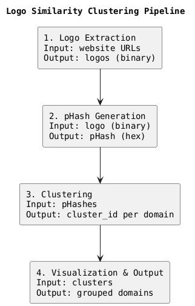

# Logo Similarity Clustering with PySpark

## 1. Project Overview

This project focuses on identifying and grouping websites that use visually similar logos.  
The solution automatically extracts logos from websites, generates a compact visual signature for each image, and groups similar ones into clusters based on their visual similarity.  
All steps are implemented in PySpark, without using any machine learning algorithms such as k-means or DBSCAN.

---

## 2. Pipeline Overview

The process is organized into four main components that work sequentially:

1. **Logo Extraction** – For each domain, the program fetches the website and identifies the image most likely to represent the brand’s logo. The image is stored as binary data in a Spark DataFrame.  
2. **pHash Generation** – Each logo image is converted into a perceptual hash (pHash), which is a compact numeric representation describing how the image looks visually rather than its exact pixels.  
3. **Clustering** – The algorithm compares every pair of pHashes using Hamming distance, which measures how many bits differ between them. Logos with similar pHashes (below a chosen distance threshold) are considered connected and grouped together into clusters.  
4. **Visualization and Output** – The results are aggregated and exported, showing each website’s domain and the cluster it belongs to.

---

## 3. Technical Choices and Reasoning

**Perceptual Hash (pHash)**  
A perceptual hash is a numeric fingerprint of an image that reflects its visual structure instead of its raw data.  
Two logos that look similar will have pHashes that differ only in a few bits, even if they are resized, compressed, or slightly modified.  
This makes it ideal for detecting visual similarity in a scalable way.

**Hamming Distance**  
The Hamming distance counts how many bits are different between two hashes.  
A small Hamming distance means the images are visually alike.  
It is simple to compute, efficient for large datasets, and produces interpretable results.

**PySpark**  
PySpark enables distributed data processing and handles the large number of pairwise comparisons efficiently.  
By using binary storage for images and Parquet for intermediate results, the pipeline remains scalable and consistent.

---

## 4. Output Structure

The final output of the clustering process is stored in the `logo_clusters` dataset.  
Each row represents a single website and contains the following fields:

- **id** – The domain name of the website.  
- **cluster_id** – The identifier of the visual cluster that the domain belongs to.  
  The cluster identifier is the lexicographically smallest domain within that cluster, serving as the representative of all visually similar logos.

---

## 5. Results and Future Improvements

The solution successfully extracted and processed over 97% of all available logos and produced perceptual hashes for nearly all of them.  
The clustering grouped thousands of domains into coherent sets based on visual similarity.

Possible future improvements include:
- Implementing the graph construction and propagation using Spark RDDs or GraphX for higher scalability.
- Adding a visualization tool to display clusters as connected graphs and better analyze the logo similarity relationships.
- Improving logo detection to handle missing or generic icons more accurately.
